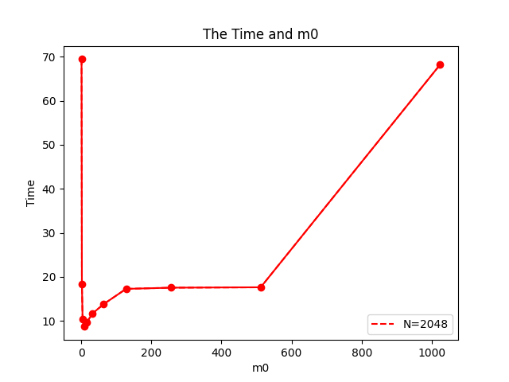

# 多核软件设计 Problem 2.8报告
罗宇成，202021045751

## 问题描述
map是C++ STL中常用的数据结构。本实验对身份证号查询相应的个人信息的问题进行探索，其中身份证号为Key，相应的人为Value，以map为基本数据结构设计了四种不同的方案，并在不同的数据规模对性能进行了测试。

## 实验环境
| CPU: | Intel(R) Xeon(R) CPU E5-2630 v3 @ 2.40GHz   |
| ------------- | ------------- |
| 内存: | 128GiB  |
| 操作系统: | Ubuntu 20.04.1  |
| 编译器: | gcc 9.3.0-17ubuntu1~20.04  |
| 编译参数: | g++ main.cpp -O3 -fno-tree-vectorize  |


## 问题解析
### 1
CPU信息如下，其中L1d cache为512KiB，软件信息见实验环境。
```
Model name:                      Intel(R) Xeon(R) CPU E5-2630 v3 @ 2.40GHz
Stepping:                        2
CPU MHz:                         1349.263
CPU max MHz:                     3200.0000
CPU min MHz:                     1200.0000
BogoMIPS:                        4789.08
Virtualization:                  VT-x
L1d cache:                       512 KiB
L1i cache:                       512 KiB
L2 cache:                        4 MiB
L3 cache:                        40 MiB
```

### 2
|N| 运行时间|
| ------------- | ------------- |
|512  | 0.29    |
|1024 | 2.09    |
|2048 | 68.90   |
|4096 | 645.41  |


512	        8	    0.287309	0.1107
1024	    8	    2.08755	    0.951127
2048	    8	    68.9022	    8.62918
4096	    8	    645.407	    76.9481

### 3
算法复杂度为O(n3) 基本满足预期，但在1024-2048这一段有较大的偏离。

### 4
N*3  + N2*(N-1) 分为乘法和加法


| N   | 每秒单精度浮点计算次数 | 
| ------------- | ------------- |
| 512 | 933396837.55 |
| 1024 | 1028207742.09 |
| 2048 | 249276146.19 |
| 4096 | 212923281.37 |

如上表所示，随着N的增大，每秒单精度浮点计算次数先增大后减小，且在1024之后，减小十分得迅速，预计之后持续减小。


### 5
硬件平台的L1d Cache容量为512KB。

设矩阵块为x，
4*3*x*x = 512K，求解得x=209。
在二进制的解对于计算机计算更加友好，若只考虑一级数据Cache的话，m0取128，256应该都比较合适。

### 6

如下表所示，是在N = 2048的情况下，矩阵分块的运行时间, 和对应的时间运行图。

| m0   | 运行时间（s） | 
| ------------- | ------------- |
| 1 | 69.44 |
| 2 | 18.37 |
| 4 | 10.33 |
| 8 | 8.72 |
| 16 | 9.69 |
| 32 | 11.69 |
| 64 | 13.83 |
| 128 | 17.29 |
| 256 | 17.56 |
| 512 | 17.66 |
| 1024 | 68.23 |




可以看出在m0 = 8的时候，程序运行的时间最短。而在两端时间逐渐增加。
根据前面得出的结论 若只考虑L1 Cache， m0=209的时候，性能应该最优，而在表格附近，确实看到m在209附近比m=1024上的数据要好多。
而在实际的运行过程中 m0=8的性能最优。 可能此次实验L1 Cache并不是矩阵计算最关键因素，而存在其他因素（如CPU 寄存器数量）

### 7

#### 加速比
| m0   | 加速比 | 
| ------------- | ------------- |
| 1 | 1.01 |
| 2 | 3.83 |
| 4 | 6.80 |
| 8 | 8.05 |
| 16 | 7.25 |
| 32 | 6.01 |
| 64 | 5.08 |
| 128 | 4.06 |
| 256 | 4.00 |
| 512 | 3.98 |
| 1024 | 1.03 |

#### 单精度浮点数运算次数
| m0   | 次数 | 
| ------------- | ------------- |
| 1 | 247343767.40 |
| 2 | 935214117.78 |
| 4 | 1662022689.71 |
| 8 | 1969150034.74 |
| 16 | 1772072906.46 |
| 32 | 1468759610.06 |
| 64 | 1242219698.26 |
| 128 | 993301615.24 |
| 256 | 977907552.51 |
| 512 | 972850460.49 |
| 1024 | 251734590.27 |